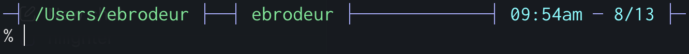

# GoPrompt

[](https://www.codefactor.io/repository/github/erniebrodeur/goprompt)
[](LICENSE)

GoPrompt is a compact, two-line prompt for Zsh. It shows the current directory, Git state, user, optional SSH host, and local time without giving up the full width of the terminal.



## Features

- Shortens long working directories based on the terminal width.
- Shows the current Git branch and marks dirty repositories with `*`.
- Adds `(push)` or `(pull)` when the branch is ahead of or behind its remote.
- Shows the hostname when the shell is running over SSH.
- Fills the space between segments to match the terminal width.
- Provides colored output, a local clock, and the current date.

## Install

GoPrompt requires Go 1.19 or newer to install from source.

```sh
go install github.com/erniebrodeur/goprompt/cmd/goprompt@latest
```

Make sure Go's binary directory, normally `$HOME/go/bin`, is on your `PATH`.

## Zsh integration

Add this to `~/.zshrc`:

```zsh
autoload -Uz add-zsh-hook

_goprompt_precmd() {
  PROMPT="$(goprompt)"
}

add-zsh-hook precmd _goprompt_precmd
_goprompt_precmd
```

Reload the configuration with `source ~/.zshrc` or open a new terminal.

Git is optional at runtime. Outside a repository, or when Git is unavailable, GoPrompt simply leaves out the Git segment.

## Git indicators

| Indicator | Meaning |
| --- | --- |
| `:main` | Current branch |
| `:main*` | Working tree has changes |
| `:main (push)` | Local branch is ahead of its remote |
| `:main (pull)` | Local branch is behind its remote |

## CLI options

| Option | Description |
| --- | --- |
| `-v`, `--version` | Print the installed version |
| `-s`, `--status` | Print each prompt segment separately for diagnostics |

## Development

```sh
git clone https://github.com/erniebrodeur/goprompt.git
cd goprompt
go test ./...
go build -o goprompt ./cmd/goprompt
```

## License

GoPrompt is available under the [MIT License](LICENSE).
